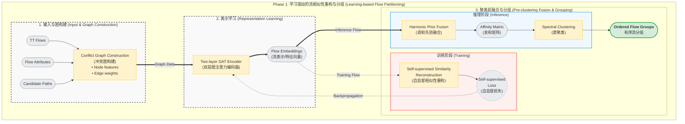

```mermaid
flowchart LR
    %% 定义样式
    classDef inputBlock fill:#f9f9f9,stroke:#333,stroke-width:2px,stroke-dasharray: 5 5;
    classDef trainBlock fill:#fff0f0,stroke:#ff6b6b,stroke-width:2px;
    classDef inferBlock fill:#f0f8ff,stroke:#4dabf7,stroke-width:2px;
    classDef dataNode fill:#e9ecef,stroke:#adb5bd,stroke-width:1px;
    classDef modelNode fill:#fff3cd,stroke:#ffe066,stroke-width:2px;
    classDef outputNode fill:#d4edda,stroke:#28a745,stroke-width:2px;

    subgraph Phase1 ["Phase 1: 学习驱动的流相似性重构与分组 (Learning-based Flow Partitioning)"]
        direction LR

        %% ================= 左侧：输入与图构建 =================
        subgraph Left ["1. 输入与图构建 (Input & Graph Construction)"]
            direction TB
            I1([TT Flows]):::dataNode
            I2([Flow Attributes]):::dataNode
            I3([Candidate Paths]):::dataNode
            
            CG["Conflict Graph Construction<br/>(冲突图构建)<br/>• Node features<br/>• Edge weights"]:::modelNode
            
            I1 --> CG
            I2 --> CG
            I3 --> CG
        end

        %% ================= 中间：表示学习 =================
        subgraph Middle ["2. 表示学习 (Representation Learning)"]
            direction TB
            GAT["Two-layer GAT Encoder<br/>(双层图注意力编码器)"]:::modelNode
            EMB(["Flow Embeddings<br/>(流表示/特征向量)"]):::dataNode
            
            GAT ==> EMB
        end

        %% ================= 右侧：聚类前融合与分组 =================
        subgraph Right ["3. 聚类前融合与分组 (Pre-clustering Fusion & Grouping)"]
            direction TB
            
            %% 训练阶段
            subgraph Training ["训练阶段 (Training)"]
                direction TB
                SSR["Self-supervised Similarity<br/>Reconstruction<br/>(自监督相似性重构)"]:::modelNode
                Loss(("Self-supervised<br/>Loss<br/>(自监督损失)")):::dataNode
                
                SSR --> Loss
            end
            
            %% 推理阶段
            subgraph Inference ["推理阶段 (Inference)"]
                direction TB
                HPF["Harmonic Prior Fusion<br/>(调和先验融合)"]:::modelNode
                AM(["Affinity Matrix<br/>(亲和矩阵)"]):::dataNode
                SC["Spectral Clustering<br/>(谱聚类)"]:::modelNode
                
            end
            
            Out([<b>Ordered Flow Groups</b><br/>有序流分组]):::outputNode
        end
    end

    %% ================= 跨模块连接 =================
    %% 主干数据流
    CG ==>|Graph Data| GAT
    
    %% 训练流 (红色虚线)
    EMB -.->|Training Flow| SSR
    Loss -.->|Backpropagation| GAT
    
    %% 推理流 (蓝色实线)
    EMB ===>|Inference Flow| HPF
    HPF --> AM --> SC --> Out

    %% 应用颜色类
    class Training trainBlock;
    class Inference inferBlock;
    class Left,Middle inputBlock;
```

