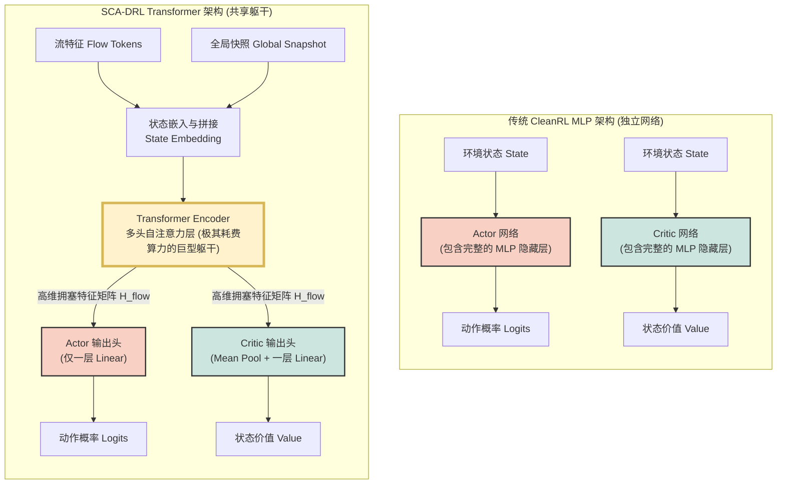

```mermaid
graph TD
    subgraph "传统 CleanRL MLP 架构 (独立网络)"
        direction TB
        State1[环境状态 State] --> Actor_MLP["Actor 网络<br>(包含完整的 MLP 隐藏层)"]
        State2[环境状态 State] --> Critic_MLP["Critic 网络<br>(包含完整的 MLP 隐藏层)"]
        
        Actor_MLP --> Action1[动作概率 Logits]
        Critic_MLP --> Value1[状态价值 Value]
        
        style Actor_MLP fill:#f9d0c4,stroke:#333,stroke-width:2px
        style Critic_MLP fill:#cce5df,stroke:#333,stroke-width:2px
    end

    subgraph "SCA-DRL Transformer 架构 (共享躯干)"
        direction TB
        Tokens[流特征 Flow Tokens] --> Embed["状态嵌入与拼接<br>State Embedding"]
        Global[全局快照 Global Snapshot] --> Embed
        
        Embed --> Trunk["Transformer Encoder<br>多头自注意力层 (极其耗费算力的巨型躯干)"]
        
        Trunk -->|高维拥塞特征矩阵 H_flow| Actor_Head["Actor 输出头<br>(仅一层 Linear)"]
        Trunk -->|高维拥塞特征矩阵 H_flow| Critic_Head["Critic 输出头<br>(Mean Pool + 一层 Linear)"]
        
        Actor_Head --> Action2[动作概率 Logits]
        Critic_Head --> Value2[状态价值 Value]
        
        style Trunk fill:#fff2cc,stroke:#d6b656,stroke-width:4px
        style Actor_Head fill:#f9d0c4,stroke:#333,stroke-width:2px
        style Critic_Head fill:#cce5df,stroke:#333,stroke-width:2px
    end
```