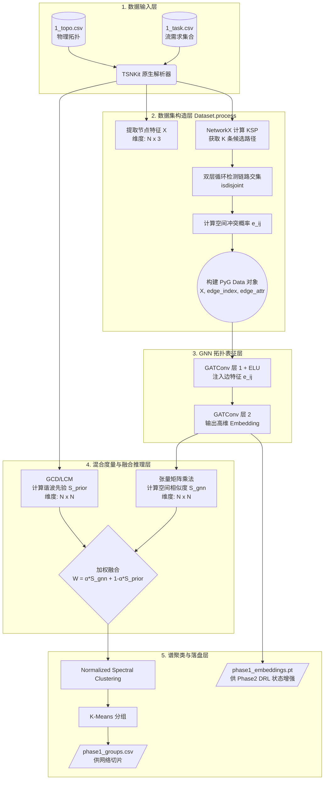

```mermaid
graph TD
    subgraph Input_Data [1. 数据输入层]
        A[(1_task.csv\n流需求集合)] --> C(TSNKit 原生解析器)
        B[(1_topo.csv\n物理拓扑)] --> C
    end

    subgraph Data_Prep [2. 数据集构造层 Dataset.process]
        C --> D[提取节点特征 X\n维度: N x 3]
        C --> E[NetworkX 计算 KSP\n获取 K 条候选路径]
        E --> F[双层循环检测链路交集\nisdisjoint]
        F --> G[计算空间冲突概率 e_ij]
        G --> H((构建 PyG Data 对象\nX, edge_index, edge_attr))
    end

    subgraph GNN_Inference [3. GNN 拓扑表征层]
        H --> I[GATConv 层 1 + ELU\n注入边特征 e_ij]
        I --> J[GATConv 层 2\n输出高维 Embedding]
    end

    subgraph Metric_Fusion [4. 混合度量与融合推理层]
        J --> K[张量矩阵乘法\n计算空间相似度 S_gnn\n维度: N x N]
        C --> L[GCD/LCM\n计算谐波先验 S_prior\n维度: N x N]
        K --> M{加权融合\nW = α*S_gnn + 1-α*S_prior}
        L --> M
    end

    subgraph Clustering_Output [5. 谱聚类与落盘层]
        M --> N[Normalized Spectral Clustering]
        N --> O[K-Means 分组]
        O --> P[/phase1_groups.csv\n供网络切片/]
        J --> Q[/phase1_embeddings.pt\n供 Phase2 DRL 状态增强/]
    end
    
```