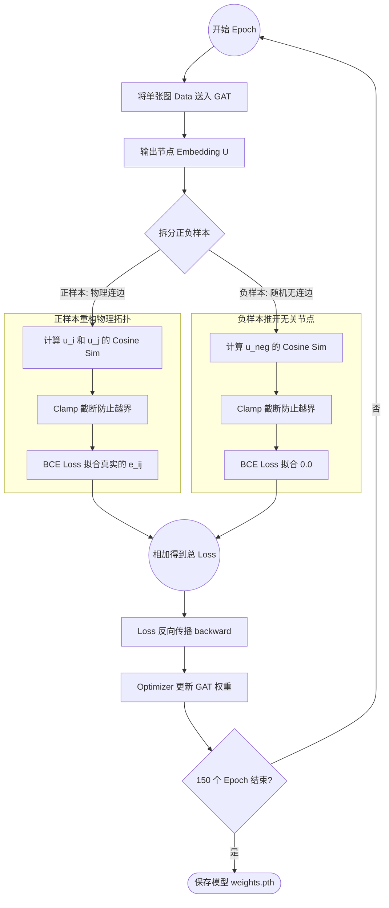

```mermaid

graph TD
    Start((开始 Epoch)) --> A[将单张图 Data 送入 GAT]
    A --> B[输出节点 Embedding U]
    B --> C{拆分正负样本}

    C -->|正样本: 物理连边| D
    C -->|负样本: 随机无连边| G

    subgraph 正样本重构物理拓扑
        D[计算 u_i 和 u_j 的 Cosine Sim]
        E[Clamp 截断防止越界]
        F[BCE Loss 拟合真实的 e_ij]
        D --> E --> F
    end

    subgraph 负样本推开无关节点
        G[计算 u_neg 的 Cosine Sim]
        H[Clamp 截断防止越界]
        I[BCE Loss 拟合 0.0]
        G --> H --> I
    end

    F --> J((相加得到总 Loss))
    I --> J

    J --> K[Loss 反向传播 backward]
    K --> L[Optimizer 更新 GAT 权重]
    L --> M{150 个 Epoch 结束?}
    M -->|否| Start
    M -->|是| Finish([保存模型 weights.pth])
```