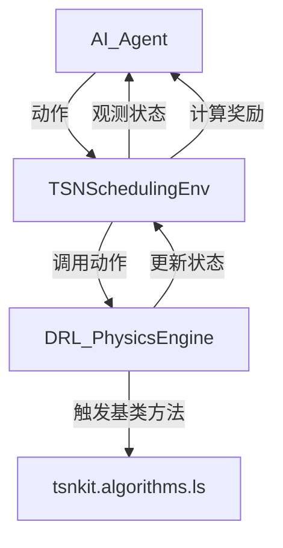

```mermaid
flowchart TD
    AI_Agent -- 动作 --> Gym_Env[TSNSchedulingEnv]
    Gym_Env -- 调用动作 --> Physics_Engine[DRL_PhysicsEngine]
    Physics_Engine -- 触发基类方法 --> tsnkit_l_s["tsnkit.algorithms.ls"]
    Physics_Engine -- 更新状态 --> Gym_Env
    Gym_Env -- 观测状态 --> AI_Agent
    Gym_Env -- 计算奖励 --> AI_Agent
```