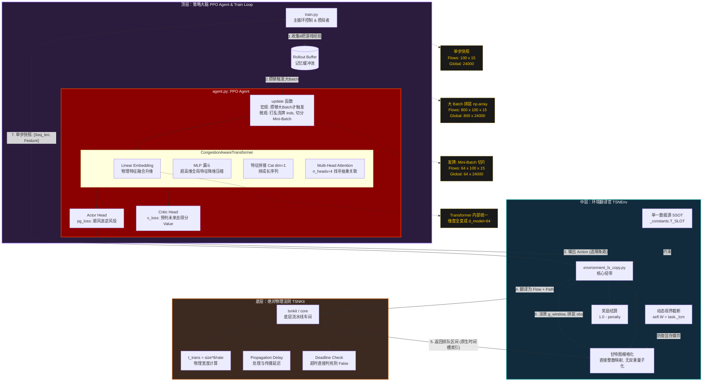

```mermaid
graph TD
    %% ================= 样式定义 =================
    classDef topLayer fill:#2b1b3d,stroke:#9d72ff,stroke-width:2px,color:#fff;
    classDef midLayer fill:#112b3c,stroke:#20b2aa,stroke-width:2px,color:#fff;
    classDef botLayer fill:#3c2a21,stroke:#d2691e,stroke-width:2px,color:#fff;
    classDef tensorBox fill:#1a1a1a,stroke:#ffcc00,stroke-width:1px,color:#ffcc00,stroke-dasharray: 5 5;
    classDef highlight fill:#8b0000,stroke:#ff4500,stroke-width:2px,color:#fff;

    %% ================= 顶层：总指挥部与大脑 =================
    subgraph Top_Level [顶层：策略大脑 PPO Agent & Train Loop]
        direction TB
        Train[train.py<br>主循环控制 & 攒局者]
        
        Buffer[(Rollout Buffer<br>记忆缓冲池)]
        
        subgraph Agent [agent.py: PPO Agent]
            direction TB
            Update[update 函数<br>宏观: 攒够大Batch才触发<br>微观: 打乱洗牌 inds, 切分 Mini-Batch]
            
            subgraph Transformer [CongestionAwareTransformer]
                direction LR
                Embed[Linear Embedding<br>物理特征融合升维]
                Funnel[MLP 漏斗<br>超高维全局特征降维压缩]
                Concat[特征拼接 Cat dim=1<br>拼成长序列]
                MHA[Multi-Head Attention<br>n_heads=4 找寻抽象关联]
            end
            
            Actor[Actor Head<br>pg_loss: 顺风浪逆风投]
            Critic[Critic Head<br>v_loss: 预判未来总得分 Value]
            
            Update --> Transformer
            Transformer --> Actor
            Transformer --> Critic
        end
        
        Train -- 1.收集8把游戏经验 --> Buffer
        Buffer -- 2.攒够触发大Batch --> Update
    end

    %% ================= 中层：翻译官与沙盘 =================
    subgraph Mid_Level [中层：环境翻译官 TSNEnv]
        direction TB
        Env[environment_ls_copy.py<br>核心纽带]
        
        SSOT[单一数据源 SSOT<br>_constants.T_SLOT]
        LCM[动态视界截断<br>self.W = task._lcm]
        
        Raster[甘特图栅格化<br>直接整数映射, 无双重量子化]
        RewardCalc[奖励结算<br>1.0 - penalty]
        
        SSOT -.约束.-> Env
        LCM -.防御显存爆炸.-> Raster
        Env --> Raster
        Env --> RewardCalc
    end

    %% ================= 底层：物理引擎 =================
    subgraph Bot_Level [底层：绝对物理法则 TSNKit]
        direction TB
        Kit[tsnkit / core<br>底层流水线车间]
        Rule1[t_trans = size*8/rate<br>物理宽度计算]
        Rule2[Propagation Delay<br>处理与传播延迟]
        Rule3[Deadline Check<br>超时直接判死刑 False]
        
        Kit --> Rule1
        Kit --> Rule2
        Kit --> Rule3
    end

    %% ================= 数据流转与张量形变 (核心看点) =================
    
    %% 下行指令流
    Actor -- "3. 输出 Action (选哪条路)" --> Env
    Env -- "4. 翻译为 Flow + Path" --> Kit
    
    %% 上行反馈流
    Kit -- "5. 返回排队区间 (原生时间槽索引)" --> Raster
    Raster -- "6. 涂黑 g_window, 拼装 obs" --> Env
    Env -- "7. 单步快照: [Seq_len, Feature]" --> Train
    
    %% 张量形变过程标注 (使用黄色虚线框凸显数学维度)
    T1:::tensorBox
    T2:::tensorBox
    T3:::tensorBox
    T4:::tensorBox
    
    Train -.-> T1[单步快照<br>Flows: 100 x 15<br>Global: 24000]
    Buffer -.-> T2[大 Batch 拼装 np.array<br>Flows: 800 x 100 x 15<br>Global: 800 x 24000]
    Update -.-> T3[发牌: Mini-Batch 切片<br>Flows: 64 x 100 x 15<br>Global: 64 x 24000]
    Embed -.-> T4[Transformer 内部统一<br>维度全变成 d_model=64]

    %% 样式应用
    class Top_Level topLayer;
    class Mid_Level midLayer;
    class Bot_Level botLayer;
    class Agent highlight;
```