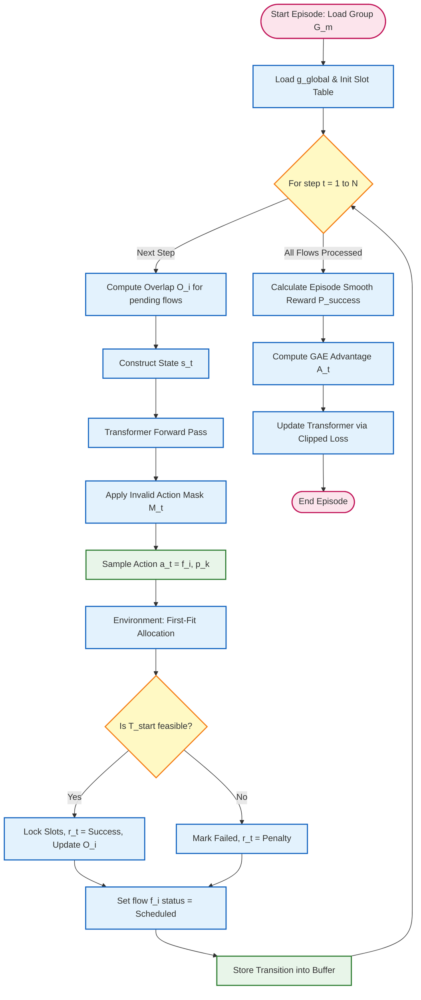

```mermaid
graph TD
    %% 样式定义
    classDef process fill:#e3f2fd,stroke:#1565c0,stroke-width:2px;
    classDef decision fill:#fff9c4,stroke:#f57f17,stroke-width:2px;
    classDef io fill:#e8f5e9,stroke:#2e7d32,stroke-width:2px;
    classDef terminal fill:#fce4ec,stroke:#c2185b,stroke-width:2px;

    %% 节点定义 (去掉了内联的 :::)
    Start([Start Episode: Load Group G_m])
    Init[Load g_global & Init Slot Table]
    
    Start --> Init
    Init --> StepLoop{For step t = 1 to N}
    
    %% Step 循环内部
    StepLoop -->|Next Step| CalcO[Compute Overlap O_i for pending flows]
    CalcO --> BuildS[Construct State s_t]
    BuildS --> Forward[Transformer Forward Pass]
    Forward --> Mask[Apply Invalid Action Mask M_t]
    Mask --> Sample[Sample Action a_t = f_i, p_k]
    
    Sample --> Env[Environment: First-Fit Allocation]
    Env --> CheckFit{Is T_start feasible?}
    
    CheckFit -->|Yes| Success[Lock Slots, r_t = Success, Update O_i]
    CheckFit -->|No| Fail[Mark Failed, r_t = Penalty]
    
    Success --> MarkFlow[Set flow f_i status = Scheduled]
    Fail --> MarkFlow
    MarkFlow --> Store[Store Transition into Buffer]
    
    Store --> StepLoop
    
    %% Step 循环结束，进入 PPO 更新
    StepLoop -->|All Flows Processed| EndEp[Calculate Episode Smooth Reward P_success]
    EndEp --> GAE[Compute GAE Advantage A_t]
    GAE --> UpdatePPO[Update Transformer via Clipped Loss]
    UpdatePPO --> EndNode([End Episode])
    
    %% 在文件末尾统一进行样式绑定 (解决报错的核心)
    class Start,EndNode terminal;
    class Init,CalcO,BuildS,Forward,Mask,Env,Success,Fail,MarkFlow,EndEp,GAE,UpdatePPO process;
    class StepLoop,CheckFit decision;
    class Sample,Store io;
```