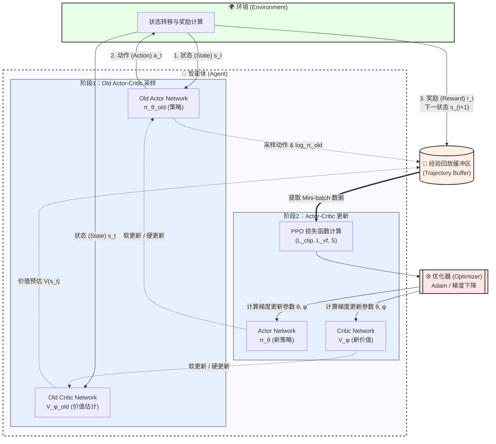

```mermaid
graph TD
    %% 定义样式
    classDef agent fill:#f9f9ff,stroke:#333,stroke-width:2px,stroke-dasharray: 5 5
    classDef env fill:#e6ffe6,stroke:#333,stroke-width:2px
    classDef buffer fill:#fff0e6,stroke:#333,stroke-width:2px
    classDef network fill:#e6f0ff,stroke:#333,stroke-width:1px
    classDef update fill:#ffe6e6,stroke:#333,stroke-width:2px

    subgraph Environment["🌍 环境 (Environment)"]
        Env[状态转移与奖励计算]
    end
    class Environment env

    subgraph Agent["🤖 智能体 (Agent)"]
        
        subgraph Sampling["阶段1：Old Actor-Critic 采样"]
            ActorOld["Old Actor Network<br/>π_θ_old (策略)"]
            CriticOld["Old Critic Network<br/>V_φ_old (价值估计)"]
        end

        subgraph Updating["阶段2：Actor-Critic 更新"]
            ActorNew["Actor Network<br/>π_θ (新策略)"]
            CriticNew["Critic Network<br/>V_φ (新价值)"]
            Loss["PPO 损失函数计算<br/>(L_clip, L_vf, S)"]
        end
        
        class Sampling,Updating network
    end
    class Agent agent

    Buffer[("💾 经验回放缓冲区<br/>(Trajectory Buffer)")]
    class Buffer buffer
    
    Optimizer[["⚙️ 优化器 (Optimizer)<br/>Adam / 梯度下降"]]
    class Optimizer update

    %% 环境交互流 (MDP要素)
    Env -- "1. 状态 (State) s_t" --> ActorOld
    Env -- "状态 (State) s_t" --> CriticOld
    ActorOld -- "2. 动作 (Action) a_t" --> Env
    Env -- "3. 奖励 (Reward) r_t<br/>下一状态 s_{t+1}" --> Buffer

    %% 采样数据存入Buffer
    ActorOld -. "采样动作 & log_π_old" .-> Buffer
    CriticOld -. "价值预估 V(s_t)" .-> Buffer

    %% 更新数据流
    Buffer ==>|提取 Mini-batch 数据| Loss
    Loss --> Optimizer
    Optimizer -->|计算梯度更新参数 θ, φ| ActorNew
    Optimizer -->|计算梯度更新参数 θ, φ| CriticNew
    
    %% 策略迭代同步
    ActorNew -. "软更新 / 硬更新" .-> ActorOld
    CriticNew -. "软更新 / 硬更新" .-> CriticOld

```
