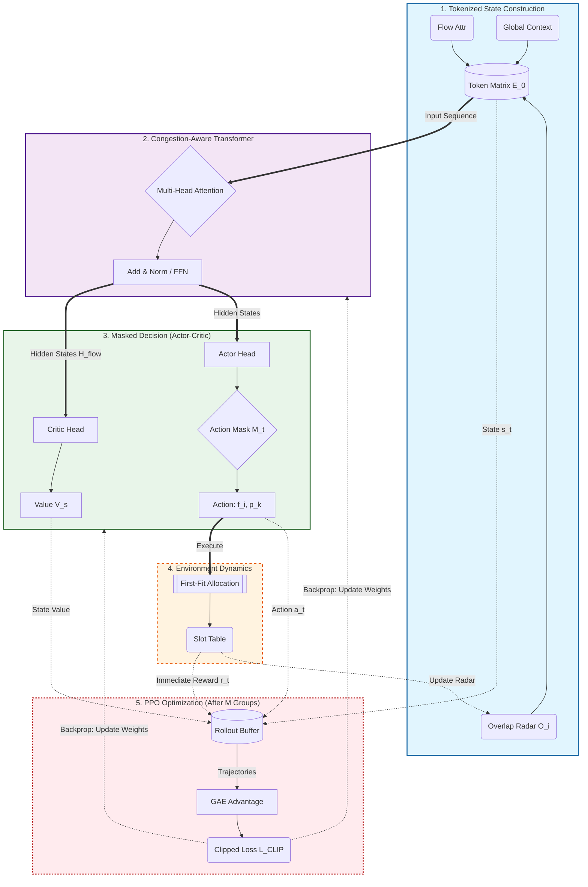

```mermaid
graph TB
    %% 定义样式
    classDef state fill:#e1f5fe,stroke:#01579b,stroke-width:2px;
    classDef trans fill:#f3e5f5,stroke:#4a148c,stroke-width:2px;
    classDef output fill:#e8f5e9,stroke:#1b5e20,stroke-width:2px;
    classDef env fill:#fff3e0,stroke:#e65100,stroke-width:2px,stroke-dasharray: 5 5;
    classDef rl fill:#ffebee,stroke:#b71c1c,stroke-width:2px,stroke-dasharray: 3 3;

    %% 模块1：状态组装
    subgraph State_Construction ["1. Tokenized State Construction"]
        direction TB
        A1(Flow Attr)
        A2(Overlap Radar O_i)
        A3(Global Context)
        B2[(Token Matrix E_0)]
        A1 & A2 & A3 --> B2
    end

    %% 模块2：拥塞感知大脑
    subgraph Transformer_Encoder ["2. Congestion-Aware Transformer"]
        direction TB
        C1{Multi-Head Attention}
        C2[Add & Norm / FFN]
        C1 --> C2
    end

    %% 模块3：双头输出
    subgraph Actor_Critic_Env ["3. Masked Decision (Actor-Critic)"]
        direction TB
        D2[Critic Head]
        D3[Actor Head]
        D4{Action Mask M_t}
        V[Value V_s]
        Act[Action: f_i, p_k]
        
        D2 --> V
        D3 --> D4 --> Act
    end

    %% 环境模块
    subgraph Environment ["4. Environment Dynamics"]
        E1[[First-Fit Allocation]]
        E2(Slot Table)
        E1 --> E2
    end

    %% 新增模块5：PPO 更新闭环
    subgraph PPO_Loop ["5. PPO Optimization (After M Groups)"]
        direction TB
        F1[(Rollout Buffer)]
        F2[GAE Advantage]
        F3(Clipped Loss L_CLIP)
        
        F1 -->|Trajectories| F2 --> F3
    end

    %% 核心前向连接
    B2 ==>|Input Sequence| C1
    C2 ==>|Hidden States H_flow| D2
    C2 ==>|Hidden States| D3
    Act ==>|Execute| E1
    
    %% 环境反馈连接
    E2 -.->|Immediate Reward r_t| F1
    E2 -.->|Update Radar| A2
    
    %% RL 数据流与参数更新连接
    V -.->|State Value| F1
    B2 -.->|State s_t| F1
    Act -.->|Action a_t| F1
    
    F3 -.->|Backprop: Update Weights| Transformer_Encoder
    F3 -.->|Backprop: Update Weights| Actor_Critic_Env

    %% 应用样式
    class State_Construction state;
    class Transformer_Encoder trans;
    class Actor_Critic_Env output;
    class Environment env;
    class PPO_Loop rl;
```