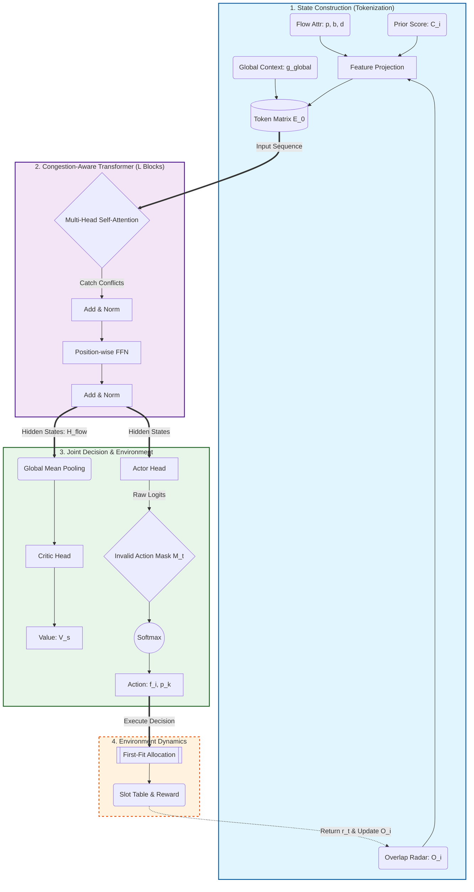

```mermaid
graph TB
    %% 定义样式
    classDef state fill:#e1f5fe,stroke:#01579b,stroke-width:2px;
    classDef trans fill:#f3e5f5,stroke:#4a148c,stroke-width:2px;
    classDef output fill:#e8f5e9,stroke:#1b5e20,stroke-width:2px;
    classDef env fill:#fff3e0,stroke:#e65100,stroke-width:2px,stroke-dasharray: 5 5;

    %% 模块1：状态组装区
    subgraph State_Construction ["1. State Construction (Tokenization)"]
        direction TB
        A1(Flow Attr: p, b, d)
        A2(Overlap Radar: O_i)
        A3(Prior Score: C_i)
        A4(Global Context: g_global)
        B1[Feature Projection]
        B2[(Token Matrix E_0)]
        
        A1 --> B1
        A2 --> B1
        A3 --> B1
        B1 --> B2
        A4 --> B2
    end

    %% 模块2：拥塞感知大脑
    subgraph Transformer_Encoder ["2. Congestion-Aware Transformer (L Blocks)"]
        direction TB
        C1{Multi-Head Self-Attention}
        C2[Add & Norm]
        C3[Position-wise FFN]
        C4[Add & Norm]
        
        C1 -->|Catch Conflicts| C2
        C2 --> C3
        C3 --> C4
    end

    %% 模块3：双头输出与环境交互
    subgraph Actor_Critic_Env ["3. Joint Decision & Environment"]
        direction TB
        D1(Global Mean Pooling)
        D2[Critic Head]
        D3[Actor Head]
        D4{Invalid Action Mask M_t}
        D5((Softmax))
        V[Value: V_s]
        Act[Action: f_i, p_k]
        
        D1 --> D2
        D2 --> V
        D3 -->|Raw Logits| D4
        D4 --> D5
        D5 --> Act
    end

    %% 环境模块
    subgraph Environment ["4. Environment Dynamics"]
        E1[[First-Fit Allocation]]
        E2(Slot Table & Reward)
        E1 --> E2
    end

    %% 跨模块连接
    B2 ==>|Input Sequence| C1
    C4 ==>|Hidden States: H_flow| D1
    C4 ==>|Hidden States| D3
    
    Act ==>|Execute Decision| E1
    E2 -.->|Return r_t & Update O_i| A2
    
    %% 应用样式 (使用类绑定解决兼容性)
    class State_Construction state;
    class Transformer_Encoder trans;
    class Actor_Critic_Env output;
    class Environment env;
```