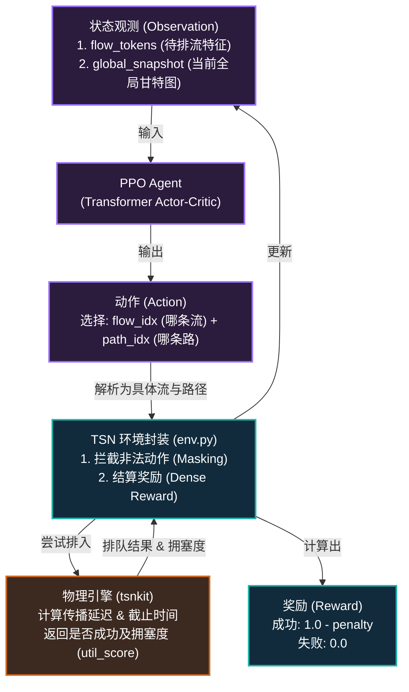

```mermaid
graph TD
    classDef rl fill:#2b1b3d,stroke:#9d72ff,stroke-width:2px,color:#fff;
    classDef env fill:#112b3c,stroke:#20b2aa,stroke-width:2px,color:#fff;
    classDef phys fill:#3c2a21,stroke:#d2691e,stroke-width:2px,color:#fff;

    State["状态观测 (Observation)<br>1. flow_tokens (待排流特征)<br>2. global_snapshot (当前全局甘特图)"]:::rl
    Agent["PPO Agent<br>(Transformer Actor-Critic)"]:::rl
    Action["动作 (Action)<br>选择: flow_idx (哪条流) + path_idx (哪条路)"]:::rl
    
    TSNEnv["TSN 环境封装 (env.py)<br>1. 拦截非法动作 (Masking)<br>2. 结算奖励 (Dense Reward)"]:::env
    
    TSNKit["物理引擎 (tsnkit)<br>计算传播延迟 & 截止时间<br>返回是否成功及拥塞度 (util_score)"]:::phys
    
    State -->|输入| Agent
    Agent -->|输出| Action
    Action -->|解析为具体流与路径| TSNEnv
    TSNEnv -->|尝试排入| TSNKit
    TSNKit -->|排队结果 & 拥塞度| TSNEnv
    TSNEnv -->|计算出| Reward["奖励 (Reward)<br>成功: 1.0 - penalty<br>失败: 0.0"]:::env
    TSNEnv -->|更新| State
```