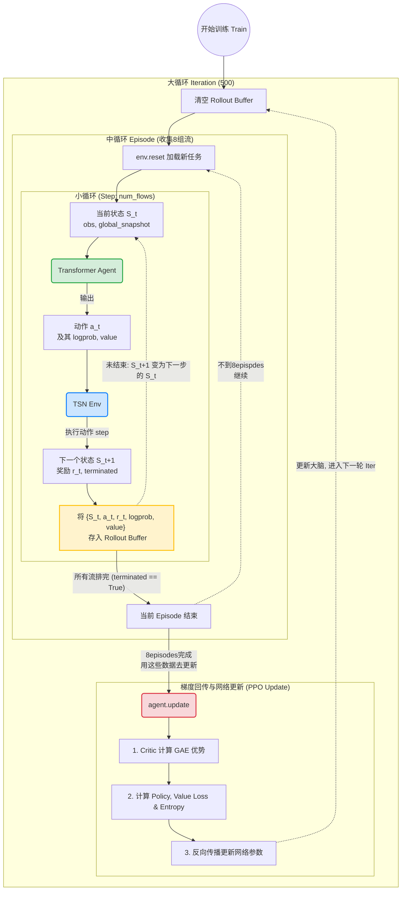

```mermaid
graph TD
    classDef loop fill:#f9f9f9,stroke:#333,stroke-width:2px,stroke-dasharray: 5 5;
    classDef agent fill:#d4edda,stroke:#28a745,stroke-width:2px;
    classDef env fill:#cce5ff,stroke:#007bff,stroke-width:2px;
    classDef buffer fill:#fff3cd,stroke:#ffc107,stroke-width:2px;
    classDef update fill:#f8d7da,stroke:#dc3545,stroke-width:2px;

    Start((开始训练 Train)) --> IterLoop["清空 Rollout Buffer"]

    subgraph "大循环 Iteration (500)"
        direction TB
        IterLoop --> EpLoop["env.reset 加载新任务"]
        
        subgraph "中循环 Episode (收集8组流)"
            direction TB
            EpLoop --> S_t["当前状态 S_t <br> obs, global_snapshot"]
            
            subgraph "小循环 (Step: num_flows)"
                direction TB
                S_t --> Agent(Transformer Agent):::agent
                Agent -- 输出 --> Action["动作 a_t <br> 及其 logprob, value"]
                Action --> Env(TSN Env):::env
                Env -- 执行动作 step --> Next["下一个状态 S_t+1 <br> 奖励 r_t, terminated"]
                Next --> Save["将 {S_t, a_t, r_t, logprob, value} <br> 存入 Rollout Buffer"]:::buffer
            end
            
            Save -. "未结束: S_t+1 变为下一步的 S_t" .-> S_t
            
            Save -- "所有流排完 (terminated == True)" --> EpEnd["当前 Episode 结束"]
        end
        
        EpEnd -. "不到8epispdes <br> 继续" .-> EpLoop
        EpEnd -- "8episodes完成 <br> 用这些数据去更新" --> UpdateStage(agent.update):::update
        
        subgraph "梯度回传与网络更新 (PPO Update)"
            direction TB
            UpdateStage --> GAE["1. Critic 计算 GAE 优势"]
            GAE --> Loss["2. 计算 Policy, Value Loss & Entropy"]
            Loss --> BP["3. 反向传播更新网络参数"]
        end
        
        BP -. "更新大脑, 进入下一轮 Iter" .-> IterLoop
    end
```