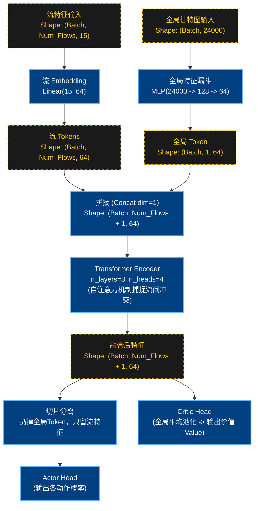

```mermaid
graph TD
    classDef tensor fill:#1a1a1a,stroke:#ffcc00,stroke-width:1px,color:#ffcc00,stroke-dasharray: 5 5;
    classDef layer fill:#004080,stroke:#66b3ff,stroke-width:2px,color:#fff;

    F_In["流特征输入<br>Shape: (Batch, Num_Flows, 15)"]:::tensor
    G_In["全局甘特图输入<br>Shape: (Batch, 24000)"]:::tensor
    
    F_Emb["流 Embedding<br>Linear(15, 64)"]:::layer
    G_MLP["全局特征漏斗<br>MLP(24000 -> 128 -> 64)"]:::layer
    
    F_Out["流 Tokens<br>Shape: (Batch, Num_Flows, 64)"]:::tensor
    G_Out["全局 Token<br>Shape: (Batch, 1, 64)"]:::tensor
    
    Concat["拼接 (Concat dim=1)<br>Shape: (Batch, Num_Flows + 1, 64)"]:::layer
    
    TF["Transformer Encoder<br>n_layers=3, n_heads=4<br>(自注意力机制捕捉流间冲突)"]:::layer
    TF_Out["融合后特征<br>Shape: (Batch, Num_Flows + 1, 64)"]:::tensor
    
    Slice["切片分离<br>扔掉全局Token，只留流特征"]:::layer
    
    Actor["Actor Head<br>(输出各动作概率)"]:::layer
    Critic["Critic Head<br>(全局平均池化 -> 输出价值 Value)"]:::layer

    F_In --> F_Emb --> F_Out
    G_In --> G_MLP --> G_Out
    F_Out --> Concat
    G_Out --> Concat
    Concat --> TF --> TF_Out --> Slice
    
    Slice --> Actor
    TF_Out --> Critic
```